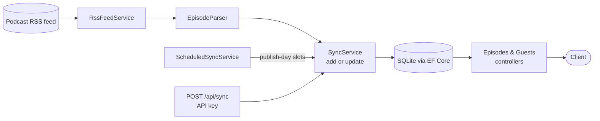

# Proletario y Parásito: Podcast API

[](https://github.com/xabierfj/podcast-api/actions/workflows/ci.yml)
[](LICENSE)

> **Disclaimer:** This is an unofficial, fan-made project. It is not affiliated with or endorsed by the
> *Proletario y Parásito* podcast or its creators. All podcast content and branding belong to their respective owners.

A REST API for the Spanish podcast *Proletario y Parásito*, a show that reviews *The Simpsons* episode by episode.
It reads the podcast's public RSS feed and turns the free-text titles and descriptions into structured data:
episode numbers, guests, specials, and the *Simpsons* episode each show discusses. It serves that data through a small, paged JSON API.

**Stack:** .NET 9 · ASP.NET Core · EF Core · SQLite · Serilog · xUnit · Docker · GitHub Actions

## Highlights

- **Parses titles and descriptions.** Titles such as `136- Repasar capítulos buenos? Oblíganos! (con Sergio Poyal) | Proletario y Parásito`
  become an episode number, a clean title, and a list of guests. Descriptions are stripped of HTML and searched for the
  `[Episodio referencia: 07x18 - …]` tag, which links each episode to its *Simpsons* season and episode.
- **Safe to re-run.** Each sync adds new episodes and updates existing ones, using the audio URL as the unique key.
  Guest names are unique too, so a guest who appears in many episodes is stored once.
- **Syncs on publish days.** A background service syncs at fixed slots on the days new episodes come out
  (e.g. every 3 h on Tuesdays, Europe/Madrid time), instead of polling all week.
- **Protected write endpoint.** `POST /api/sync` needs an API key, compared in constant time.
- **Ready to deploy.** Multi-stage Docker image, a Compose file with a persistent volume for the database and logs,
  and CI that builds, tests, and fails on vulnerable NuGet packages.

## Architecture



```
PodcastApi/
├── Controllers/   Episodes, Guests, Sync endpoints
├── Data/          EF Core DbContext (unique indexes on AudioUrl and Guest.Name)
├── Domain/        Episode, Guest (many-to-many)
├── Dto/           Response contracts
├── Filters/       API-key authorization filter
├── Mappers/       Entity → DTO
├── Parsing/       Title and description parser
├── Rss/           Feed download and XML reading
└── Sync/          Sync logic and background scheduler
PodcastApi.Tests/  xUnit tests: parser, duration parsing, schedule calculation
```

## Getting started

**Requirements:** .NET 9 SDK (or Docker only).

```bash
dotnet run --project PodcastApi
```

The API starts on `http://localhost:5078`, with Swagger UI at `/swagger`. The SQLite database
is created on first run. To load episodes, call the sync endpoint (see [Configuration](#configuration) for the key):

```bash
dotnet user-secrets set ApiKey "dev-key" --project PodcastApi
curl -X POST http://localhost:5078/api/sync -H "X-Api-Key: dev-key"
```

### Docker

```bash
cp .env.example .env        # set API_KEY
docker compose up -d --build
```

The container listens on `http://localhost:8080` (change it with `API_PORT`), with Swagger UI at `/swagger`. Scheduled sync is on, and the first
sync runs at startup. The database and daily log files are stored in the `podcast-data` volume, so they survive restarts.

## API

| Method | Route                                | Description                                   |
|--------|--------------------------------------|-----------------------------------------------|
| GET    | `/api/episodes?page=1&pageSize=20`   | Paged episodes, newest first, specials last   |
| GET    | `/api/episodes/latest`               | The most recently published episode           |
| GET    | `/api/episodes/{id}`                 | A single episode                              |
| GET    | `/api/guests`                        | All guests with their appearance count        |
| GET    | `/api/guests/{id}/episodes`          | A guest and the episodes they appeared in     |
| POST   | `/api/sync`                          | Sync from the RSS feed (needs `X-Api-Key`)    |

`pageSize` is limited to 100. Example response for `GET /api/episodes?pageSize=1`:

```json
{
  "items": [
    {
      "id": 2,
      "episodeNumber": 136,
      "title": "Repasar capítulos buenos? Oblíganos!",
      "description": "Bart y Lisa descubren que Chester Lampwick es el verdadero creador de Rasca y Pica… [Episodio referencia: 07x18 - El día que murió la violencia]",
      "publicationDate": "2026-02-10T05:30:00",
      "formattedEpisodeNumber": "#136",
      "formattedDuration": "01:09:04",
      "isSpecial": false,
      "simpsonsSeason": 7,
      "simpsonsEpisode": 18,
      "simpsonsTitle": "El día que murió la violencia",
      "spotifyUrl": "https://podcasters.spotify.com/pod/show/proletarioyparasito/episodes/…",
      "audioUrl": "https://traffic.megaphone.fm/APO7104903413.mp3",
      "imageUrl": "https://d3t3ozftmdmh3i.cloudfront.net/…",
      "guests": ["Sergio Poyal"]
    }
  ],
  "totalCount": 137,
  "page": 1,
  "pageSize": 1
}
```

`POST /api/sync` returns counts for the run. On a fresh database it returns
`{ "feedItems": 137, "added": 137, "updated": 0 }`, and on later runs `{ "feedItems": 137, "added": 0, "updated": 137 }`.

## Configuration

All defaults are in `PodcastApi/appsettings.json`. You can override any of them with environment variables
(use `__` for nesting, e.g. `Sync__Days`).

| Key                         | Default                   | Purpose                                              |
|-----------------------------|---------------------------|------------------------------------------------------|
| `ApiKey`                    | *(empty: every call returns 401)* | Key required by `POST /api/sync`                     |
| `ConnectionString:Default`  | `Data Source=podcast.db`  | SQLite database path                                 |
| `Rss:FeedUrl`               | the podcast's Anchor feed | RSS source                                           |
| `Sync:Enabled`              | `false` (`true` in Compose) | Turns on the background scheduler                  |
| `Sync:Days`                 | `Tuesday`                 | Comma-separated publish days                         |
| `Sync:IntervalHours`        | `3`                       | Hours between slots on those days, counted from midnight |
| `Sync:TimeZone`             | `Europe/Madrid`           | Time zone the slots are calculated in                |
| `Sync:RunAtStartup`         | `true`                    | Sync once when the app starts                        |
| `Logging:Directory`         | `logs`                    | Folder for the daily log files (31 days are kept)    |

If the Sync settings are invalid, the app stops at startup instead of quietly using a different schedule.

## Testing

```bash
dotnet test
```

The tests cover the parts most likely to break:
- the title and description parser, for each title format the feed uses (numbered, with guests, specials, unknown);
- duration parsing (`620`, `mm:ss`, `hh:mm:ss`, and invalid input);
- the schedule calculation, including moving to the next week and times that fall exactly on a slot.

CI (`.github/workflows/ci.yml`) runs the tests, plus a Release build and a check for vulnerable NuGet packages,
on every push and pull request to `main`.

## Design decisions

The scope is kept small on purpose, to fit a read-heavy API over one RSS feed:

- **No repository or service layers over EF Core.** Controllers query the `DbContext` directly, and `DbContext`
  already works as a unit of work. The only real logic (parsing and sync) has its own classes and tests.
- **SQLite with `EnsureCreated` instead of migrations.** The database can be rebuilt from the feed at any time,
  so there is no data that migrations would need to protect.
- **The audio URL is the unique key.** Episode numbers are missing for specials and titles get edited, but the
  audio file URL stays the same, so it is the most reliable way to tell episodes apart.
- **Sync on a schedule, not on each request.** Reads stay fast and don't depend on the feed being up.
  Scheduling only on publish days keeps traffic to the feed low without adding much delay.

## License

[MIT](LICENSE)
